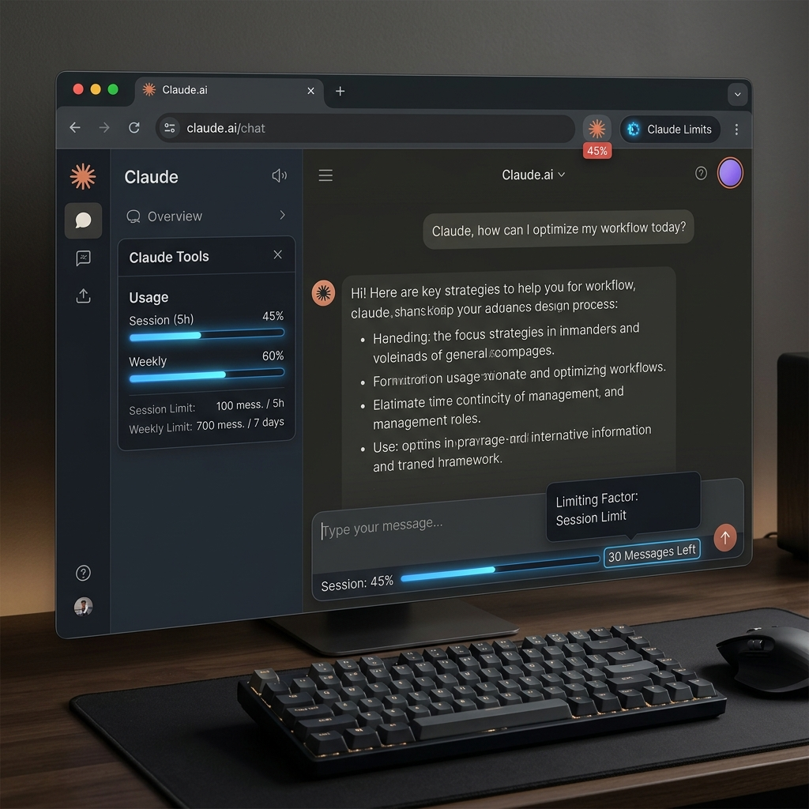

# Claude Usage Tracker

**Track your Claude.ai token usage with precision.**

This browser extension provides real-time monitoring of your Claude usage quotas, helping you manage your session caps and weekly limits with ease. It goes beyond simple message counting by calculating actual token consumption from all sources.

## 🚀 Key Features

-   **📊 Real-Time Usage Badge**: Monitor your 5-hour session usage directly on the extension icon. The badge turns red when you approach your limit.
*   **🔮 Smart Forecasting**: See exactly how many messages you have left based on the current conversation size. Hover over the estimate to see your "Limiting Factor" (e.g., Weekly vs. Session).
*   **🧠 Prompt Caching Support**: Automatically detects Claude’s 5-minute prompt caching window and adjusts cost estimates accordingly.
*   **📁 Multi-Source Tracking**: Calculates tokens from:
    *   **Files**: Local uploads, images, and documents.
    *   **Integrations**: Synced content from Google Drive and GitHub.
    *   **Context**: Project knowledge, custom instructions, and system prompts.
*   **🎯 Professional UI**: Seamlessly integrates into the Claude.ai interface with tooltips for Length, Cost, and Cache status.

## 📥 Installation

### Chrome / Edge / Brave

### Firefox

### Desktop Client
[MacOS/Windows Launcher](https://github.com/jojinjohn/Claude-WebExtension-Launcher/releases/latest)

## 🛠️ How it Works

Token calculation is handled using two methods:
1.  **Anthropic API**: If you provide an API key in settings, the extension uses Anthropic's official `count_tokens` endpoint for 100% accuracy.
2.  **Local Estimation**: By default, it uses a high-performance tokenizer (`gpt-tokenizer`) with custom weights optimized for Claude's models.

## 🔒 Privacy

Your privacy is a priority. The extension:
-   Fetches your Organization ID only to synchronize usage data.
-   Does **not** store your conversation content externally.
-   For full details, see our [Privacy Policy](PRIVACY.md).

---
*Created by [Jojin John](https://github.com/jojinjohn)*
